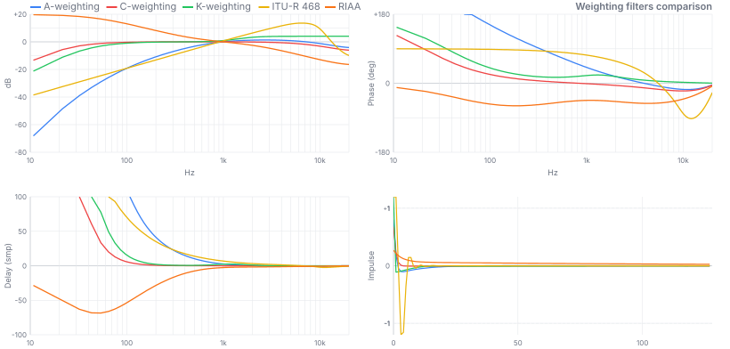
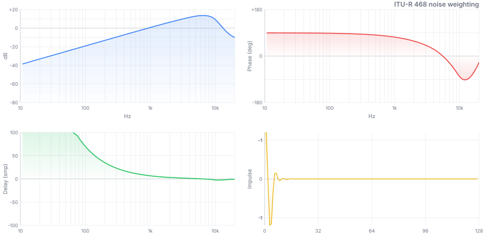
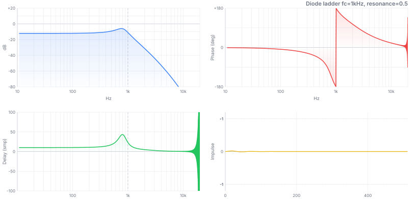
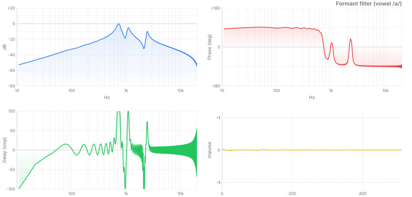
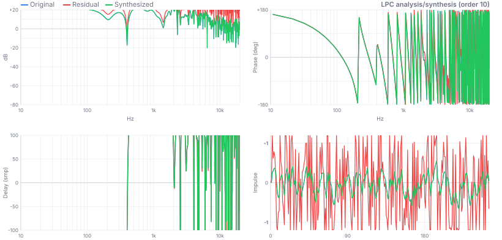
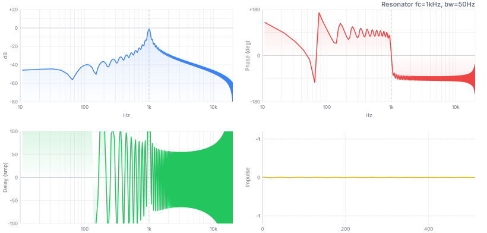
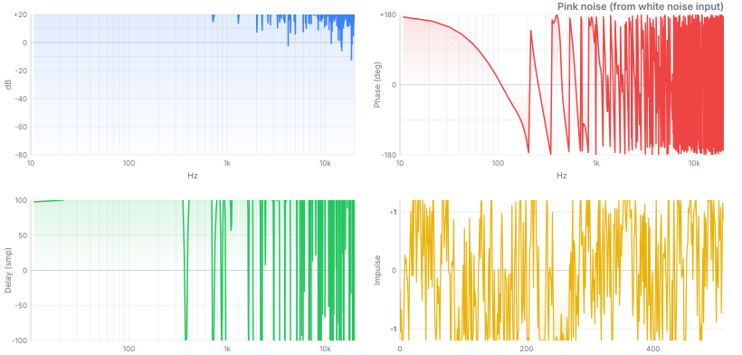
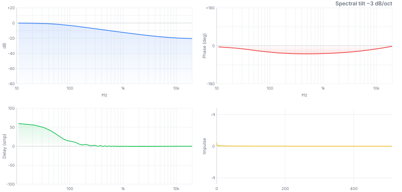

# @audio/filter [](https://github.com/audiojs/filter/actions/workflows/ci.yml) [](https://npmjs.org/package/@audio/filter) [](https://github.com/krishnized/license)

Canonical audio filter implementations.<br>

<table><tr><td valign="top">

**[Weighting](#weighting)**<br>
<sub>[A-weighting](#a-weighting) · [C-weighting](#c-weighting) · [K-weighting](#k-weighting) · [ITU-R 468](#itu-r-468) · [RIAA](#riaa)</sub>

**[Auditory](#auditory)**<br>
<sub>[Gammatone](#gammatone) · [Octave bank](#octave-bank) · [ERB bank](#erb-bank) · [Bark bank](#bark-bank) · [Mel bank](#mel-bank)</sub>

**[Analog](#analog)**<br>
<sub>[Moog ladder](#moog-ladder) · [Diode ladder](#diode-ladder) · [Korg35](#korg35) · [Oberheim](#oberheim)</sub>

</td><td valign="top">

**[Speech](#speech)**<br>
<sub>[Formant](#formant) · [Vocoder](#vocoder) · [LPC](#lpc)</sub>

**[EQ](#eq)**<br>
<sub>[Graphic EQ](#graphic-eq) · [Parametric EQ](#parametric-eq) · [Crossover](#crossover) · [Crossfeed](#crossfeed) · [Shelving](#shelving) · [Baxandall](#baxandall) · [Tilt EQ](#tilt-eq)</sub>

**[Effect](#effect)**<br>
<sub>[DC blocker](#dc-blocker) · [Comb](#comb-filter) · [Allpass](#allpass) · [Pre-emphasis](#pre-emphasis--de-emphasis) · [Lowpass](#lowpass) · [Highpass](#highpass) · [Bandpass](#bandpass) · [Notch](#notch) · [Resonator](#resonator) · [Pink noise](#pink-noise) · [Spectral tilt](#spectral-tilt) · [Variable bandwidth](#variable-bandwidth)</sub>

</td></tr></table>

## Install

```
npm install @audio/filter
```

```js
// import everything
import * as filter from '@audio/filter'

// import by domain
import { aWeighting, kWeighting } from '@audio/weighting'
import { gammatone, melBank } from '@audio/auditory'
import { moogLadder, oberheim } from '@audio/filter'
import { vocoder, lpcAnalysis } from '@audio/speech'
import { parametricEq, crossover, baxandall, tilt, lowShelf, highShelf } from '@audio/eq'
import { dcBlocker, notch, lowpass, highpass, bandpass, resonator } from '@audio/filter'
```


## API

Most filters share one shape:

```js skip
filter(buffer, params)   // → buffer (modified in-place)
```

Takes an `Array`/`Float32Array`/`Float64Array`, modifies it in-place, returns it. Pass the same params object on every call to persist state across blocks automatically:

```js
import { moogLadder } from '@audio/filter'

let params = { fc: 1000, resonance: 0.5, fs: 44100 }
for (let buf of stream) moogLadder(buf, params)
```

Three families, by shape:

- **In-place, single buffer** — `filter(buffer, params) → buffer`. The majority: weighting, analog, effect, most of EQ.
- **In-place, dual buffer** — `filter(bufA, bufB, params) → { ... }`. `crossfeed(left, right, params)`, `vocoder(carrier, modulator, params)` — two channels/signals interact, so neither buffer alone is the whole story.
- **Designers/analyzers** — take no buffer, return descriptor/SOS data instead of processing anything: `octaveBank`, `erbBank`, `barkBank`, `melBank`, `crossover`, `lpcAnalysis`. Feed their output to `digital-filter`'s `filter()` or to `lpcSynthesize`.

For frequency analysis, weighting filters expose a `.coefs(fs)` method returning a second-order sections (SOS) array — `[{b0, b1, b2, a1, a2}, ...]`, one biquad per section — for use with `digital-filter`:

```js
import { aWeighting } from '@audio/weighting'
import { freqz, mag2db } from 'digital-filter'

let sos  = aWeighting.coefs(44100)
let resp = freqz(sos, 2048, 44100)
let db   = mag2db(resp.magnitude)
```


## Weighting

Standard measurement curves. Each is defined by a standards body to a specific curve shape and normalization.



| filter | standard | normalized |
|---|---|---|
| `aWeighting` | IEC 61672-1:2013 | 0 dB at 1 kHz |
| `cWeighting` | IEC 61672-1:2013 | 0 dB at 1 kHz |
| `kWeighting` | ITU-R BS.1770-4:2015 | — |
| `itu468` | ITU-R BS.468-4:1986 | +12.2 dB at 6.3 kHz |
| `riaa` | RIAA 1954 | 0 dB at 1 kHz |


### A-weighting

Models how the ear perceives loudness — attenuates low and very high frequencies.

**Transfer function**: $H(s) = \frac{Ks^4}{(s+\omega_1)^2(s+\omega_2)(s+\omega_3)(s+\omega_4)^2}$<br>
**Poles**: $\omega_1 = 2\pi \cdot 20.6\,\text{Hz}$, $\omega_2 = 2\pi \cdot 107.7\,\text{Hz}$, $\omega_3 = 2\pi \cdot 737.9\,\text{Hz}$, $\omega_4 = 2\pi \cdot 12194\,\text{Hz}$<br>
**Implementation**: matched z-transform ($z_k = e^{s_k/f_s}$), 3 SOS sections — no frequency warping near Nyquist<br>
**Normalization**: 0 dB at 1 kHz (IEC requirement)

```js
import { aWeighting } from '@audio/weighting'

let p = { fs: 44100 }
for (let buf of stream) aWeighting(buf, p)   // A-weighted stream
```

**Standard**: IEC 61672-1:2013[^1]<br>
**Use when**: measuring SPL, noise, OSHA compliance, audio quality<br>
**Not for**: loudness in broadcast (use K-weighting), noise annoyance (use ITU-468)


### C-weighting

Like A-weighting but flatter — less rolloff at low and high frequencies.

**Transfer function**: $H(s) = \frac{Ks^2}{(s+\omega_1)^2(s+\omega_4)^2}$<br>
**Poles**: $\omega_1 = 2\pi \cdot 20.6\,\text{Hz}$, $\omega_4 = 2\pi \cdot 12194\,\text{Hz}$ (same as A-weighting outer poles)<br>
**Implementation**: matched z-transform, 2 SOS sections

```js
import { cWeighting } from '@audio/weighting'

cWeighting(buffer, { fs: 44100 })
```

**Standard**: IEC 61672-1:2013[^1]<br>
**Use when**: peak sound level measurement, where A-weighting over-penalizes bass<br>
**Compared to A**: rolls off below 31.5 Hz and above 8 kHz; flat 31.5 Hz–8 kHz


### K-weighting

The loudness measurement curve — a high shelf plus a highpass. Used to compute LUFS.

**Stage 1**: pre-filter — high shelf +4 dB above ~1.7 kHz (head diffraction simulation)<br>
**Stage 2**: RLB highpass — 2nd-order Butterworth at ~38 Hz (removes sub-bass)<br>
**Coefficients**: one fs-general analytic formula (BS.1770 Annex 1 analog prototype, pre-warped per `fs`) — reproduces the spec's published 48 kHz table to ~1e-11 and stays exact by construction at any other sample rate, not a lesser approximation elsewhere

```js
import { kWeighting } from '@audio/weighting'

kWeighting(buffer, { fs: 48000 })   // BS.1770 spec sample rate
kWeighting(buffer, { fs: 44100 })   // same formula, exact by construction
```

**Standard**: ITU-R BS.1770-4:2015[^2], EBU R128<br>
**Use when**: computing integrated loudness (LUFS/LKFS), broadcast loudness normalization<br>
**Not for**: A-weighted SPL measurement (different shape, different standard)


### ITU-R 468

Peaked noise weighting — peaks at +12.2 dB near 6.3 kHz — models how humans actually perceive noise annoyance.

**Shape**: rises steeply from 31.5 Hz, peaks at +12.2 dB at 6.3 kHz, rolls off above 10 kHz<br>
**Implementation**: exact matched z-transform of the analog BS.468-4 rational realization (pre-verified poles, 0.05 dB analog accuracy); discretization adds error near Nyquist at low sample rates (e.g. ~16 dB at 20 kHz at 44.1 kHz) — see `test/weighting.js` for the measured per-sample-rate tolerances

```js
import { itu468 } from '@audio/weighting'

itu468(buffer, { fs: 48000 })
```

**Standard**: ITU-R BS.468-4:1986[^3] (original CCIR 468, 1968)<br>
**Rationale**: human hearing is more sensitive to short noise bursts than sine tones; 468 weights accordingly<br>
**Use when**: measuring noise in broadcast equipment, tape noise, hum and hiss<br>
**Compared to A-weighting**: 6.3 kHz peak makes it harsher on hiss; preferred in European broadcast




### RIAA

Playback equalization for vinyl records — a shelving curve with three time constants.

**Transfer function**: $H(s) = \frac{1 + sT_2}{(1 + sT_1)(1 + sT_3)}$<br>
**Time constants**: $T_1 = 3180\,\mu\text{s}$ (50.05 Hz pole), $T_2 = 318\,\mu\text{s}$ (500.5 Hz zero), $T_3 = 75\,\mu\text{s}$ (2122 Hz pole)<br>
**Implementation**: 1 SOS section via bilinear transform, normalized 0 dB at 1 kHz

```js
import { riaa } from '@audio/weighting'

riaa(phonoSignal, { fs: 44100 })   // correct vinyl playback
```

**Standard**: RIAA (1954)[^4]<br>
**Purpose**: playback de-emphasis undoes the mastering pre-emphasis applied during vinyl cutting<br>
**Shape**: boosts bass ~+20 dB at 20 Hz, rolls off treble; at playback restores flat response<br>
**Note**: classic 3-time-constant RIAA curve ($T_1$/$T_2$/$T_3$ above); IEC 60098 adds a 4th, ~7950 µs (~20 Hz) subsonic time constant that this implementation deliberately omits


## Auditory

Models of the human auditory system — how the cochlea and brain decompose sound into frequency channels. Used in psychoacoustics, music information retrieval, and hearing aid design.


### Gammatone

The cochlear filter — bandpass tuned to one frequency, decaying oscillation, mimics an inner hair cell.

**Model**: cascade of complex one-pole filters; 4th-order is the standard cochlear approximation<br>
**Bandwidth**: $\text{ERB} = 24.7\left(\frac{4.37 f_c}{1000} + 1\right)\,\text{Hz}$<br>
**Implementation**: complex resonator with gain normalization to 0 dB at $f_c$

```js
import { gammatone } from '@audio/auditory'

let params = { fc: 1000, fs: 44100 }
gammatone(buffer, params)   // bandpass at 1 kHz with cochlear envelope
```

**Origin**: Patterson et al. (1992)[^5]<br>
**Use when**: cochlear modeling, auditory scene analysis, psychoacoustic feature extraction<br>
**Compared to Butterworth bandpass**: gammatone has asymmetric temporal envelope matching biological data


Reuse `params` across blocks — state in `params._s`, gain cached in `params._gain`.


### Octave bank

ISO/IEC fractional-octave filter bank — the standard for acoustic measurement and spectrum analysis.

**Center frequencies**: ISO 266 series — $f_c = 1000 \cdot G^{k/n}$, $G = 10^{3/10}$<br>
**Bandwidth**: each band spans $f_c \cdot G^{-1/(2n)}$ to $f_c \cdot G^{+1/(2n)}$<br>
**1/1 octave**: 10 bands (31.5–16 kHz) — coarse; **1/3 octave**: 28 bands (default fmin/fmax 31.25/16000 Hz) — standard; **1/6+**: psychoacoustics<br>
**Returns**: array of `{ fc, coefs }` — each band is a biquad bandpass section

```js
import { octaveBank } from '@audio/auditory'
import { filter } from 'digital-filter'

let bands = octaveBank(3, 44100)   // 1/3-octave, 28 bands
for (let band of bands) {
  let buf = Float64Array.from(signal)
  filter(buf, { coefs: band.coefs })
  spectrum.push({ fc: band.fc, energy: rms(buf) })
}
```

**Standard**: IEC 61260-1:2014[^6], ANSI S1.11:2004<br>
**Use when**: acoustic measurement, noise assessment, spectrum visualization


### ERB bank

Equivalent Rectangular Bandwidth scale — how the auditory system actually spaces its channels.

**ERB formula**: $\text{ERB}(f_c) = 24.7\left(\frac{4.37 f_c}{1000} + 1\right)$<br>
**Spacing**: ~1 ERB between adjacent channels — logarithmic above 1 kHz, more linear below<br>
**Returns**: array of `{ fc, erb }` descriptors; apply `gammatone` at each `fc` for the filter bank

```js
import { erbBank, gammatone } from '@audio/auditory'

let bands  = erbBank(44100)
let states = bands.map(b => ({ fc: b.fc, fs: 44100 }))

for (let buf of stream) {
  let channels = bands.map((_, i) => {
    let b = Float64Array.from(buf)
    gammatone(b, states[i])
    return b
  })
}
```

**Origin**: Moore & Glasberg (1983, 1990)[^7]<br>
**Use when**: speech processing, hearing models, auditory feature extraction<br>
**Compared to Bark**: ERB is more accurate above 500 Hz; Bark is the psychoacoustic masking model


### Bark bank

Zwicker's 24 critical bands — the psychoacoustic foundation of perceptual audio coding.

**Scale**: 24 bands spanning 20 Hz–15.5 kHz (Zwicker's table starts at 0 Hz; this implementation keeps a practical 20 Hz first edge, honoring a caller-supplied `fmin` below 20 Hz as the first edge instead of clamping it); named after Heinrich Barkhausen<br>
**Band widths**: ~100 Hz wide below 500 Hz; ~20% of center frequency above<br>
**Returns**: array of `{ bark, fLow, fHigh, fc, coefs }` — each band is a biquad bandpass section

```js
import { barkBank } from '@audio/auditory'
import { filter } from 'digital-filter'

let bands = barkBank(44100)   // 24 critical bands
for (let band of bands) {
  let buf = Float64Array.from(signal)
  filter(buf, { coefs: band.coefs })
  excitation[band.bark] = rms(buf)
}
```

**Origin**: Zwicker (1961)[^8]<br>
**Use when**: perceptual audio coding (MP3/AAC use Bark-like groupings), loudness models, masking<br>
**Compared to ERB**: Bark bands are wider and fewer; ERB is more accurate for hearing science


### Mel bank

Mel-frequency triangular filter bank — the standard front-end for speech recognition and music information retrieval.

**Scale**: $\text{mel}(f) = 2595 \log_{10}(1 + f/700)$ (O'Shaughnessy variant)[^18]<br>
**Bands**: equally spaced in mel scale; each band is a triangle spanning 3 adjacent mel points<br>
**Returns**: array of `{ fc, fLow, fHigh, mel }` — band descriptors for MFCC computation

```js
import { melBank } from '@audio/auditory'

let bands = melBank(44100)                              // 26 bands (default)
let telephonyBands = melBank(16000, { nFilters: 40 })   // 40 bands, telephony rate
let voiceBands = melBank(44100, { fmin: 300, fmax: 8000 })
```

**Use when**: MFCC feature extraction, speech recognition, music genre classification, audio fingerprinting<br>
**Compared to ERB/Bark**: mel is the most widely used in ML; ERB is more physiologically accurate


## Analog

Discrete-time models of analog circuits — each named after the hardware it replicates. Nonlinear, stateful, process in-place. The filters in synthesizers.

**Resonance means something different per filter** — all four take `resonance` in 0–1, but the mapping and self-oscillation point differ: `moogLadder` maps $k = 4 \cdot \text{resonance}$, self-oscillates exactly at resonance=1 (Stilson & Smith 1996, <0.5% frequency error); `diodeLadder` uses the same $k = 4 \cdot \text{resonance}$ but self-oscillation shifts to ≈1.15–1.2 because its extra per-stage $\tanh$ adds damping; `korg35` maps $k = 2 \cdot \text{resonance}$ and never self-oscillates at any value — 2 real poles can't reach the −180° loop phase Barkhausen's criterion needs at any finite, audible frequency, so resonance only adds damping/saturation character; `oberheim` maps $R = 1 - \text{resonance}$ (inverted — resonance=1 gives $R=0$, maximum SVF resonance), with bandpass peak gain exactly $1/(2R)$.<br>
**`drive`** (default 1, all four filters) is input gain into each filter's $\tanh$ saturation path — `drive: 0` mutes the signal ($\tanh(0) = 0$) rather than disabling saturation and falling back to a linear filter.


### Moog ladder

Robert Moog's 4-pole transistor ladder, 1965 — the most imitated filter in electronic music.

**Circuit**: 4 cascaded one-pole transistor ladder sections, global feedback from output to input<br>
**Implementation**: Zero-delay feedback (ZDF) via trapezoidal integration — Zavalishin (2012)[^9], Ch. 6<br>
**Response**: $-24\,\text{dB/oct}$ lowpass; resonance peak at $f_c$; self-oscillation (sine wave) at resonance=1<br>
**Nonlinearity**: $\tanh$ saturation at input (transistor ladder characteristic)

```js
import { moogLadder } from '@audio/filter'

let params = { fc: 800, resonance: 0.7, fs: 44100 }
moogLadder(buffer, params)

// Self-oscillation — runs indefinitely from a single impulse
let silent = new Float64Array(4096); silent[0] = 0.01
moogLadder(silent, { fc: 1000, resonance: 1, fs: 44100 })
```

**Patent**: Moog (1965) US3475623[^10]<br>
**vs Diode ladder**: Moog saturates only at input; diode saturates at each stage — different character at high resonance


### Diode ladder

Roland TB-303 / EMS VCS3 style — per-stage saturation gives the characteristic acid "squelch".

**Circuit**: Roland TB-303, EMS VCS3, EDP Wasp<br>
**Key difference from Moog**: stages are bidirectionally coupled — no unity-gain buffers between them (unlike Moog), so each stage loads its neighbors; solved as one tridiagonal system per sample (Thomas algorithm) instead of Moog's simple forward cascade<br>
**Character**: preserves more bass at high resonance than Moog — closed-form DC gain $1/(1 + 4\cdot\text{resonance})$ vs Moog's $1/(1 + 4\cdot\text{resonance}\cdot(1+G+G^2+G^3+G^4))$, $G<1$ — and more "squelchy"/aggressive due to the per-stage $\tanh$<br>
**Implementation**: ZDF — Zavalishin (2012)[^9]; Pirkle (2019)[^11], Ch. 10<br>
**Stability**: bounded (per-stage $\tanh$-saturated) across the documented 0–1 range and well beyond; self-oscillates near resonance≈1.15–1.2 — higher than Moog's exact 1, since the extra per-stage $\tanh$ adds damping

```js
import { diodeLadder } from '@audio/filter'

let params = { fc: 500, resonance: 0.8, fs: 44100 }
diodeLadder(buffer, params)
```




### Korg35

Korg MS-10/MS-20, 1978 — 2-pole filter with lowpass and highpass outputs from nonlinear feedback.

**Topology**: 2 cascaded one-pole sections with nonlinear feedback; HP = input − LP<br>
**Response**: $-12\,\text{dB/oct}$; resonance 0–1 adds damping/saturation character — no resonant peak, no self-oscillation at any setting (2 real poles in the loop can't reach the −180° phase Barkhausen's criterion needs at any finite, audible frequency, unlike Moog/Diode's 4-pole loops)<br>
**Complementarity**: LP+HP=input holds exactly only at resonance=0 (verified to 1e-16); at resonance>0 the HP tap's extra feedback term makes LP+HP diverge from the input (measured −7.5 dB to +1.4 dB error at resonance=0.8 across 200 Hz–5 kHz)

```js
import { korg35 } from '@audio/filter'

korg35(buffer, { fc: 1000, resonance: 0.5, type: 'lowpass',  fs: 44100 })
korg35(buffer, { fc: 1000, resonance: 0.5, type: 'highpass', fs: 44100 })
```

**Circuit**: Korg MS-10/MS-20 (1978)<br>
**Analysis**: Stilson & Smith (1996)[^12]; Zavalishin (2012)[^9], Ch. 5<br>
**vs Moog ladder**: 2-pole ($-12\,\text{dB/oct}$) vs 4-pole ($-24\,\text{dB/oct}$); Korg35 has both LP and HP taps from one circuit, but no self-oscillation


### Oberheim

Oberheim SEM (1974) — 2-pole state-variable filter with four modes from one circuit.

**Topology**: 2 trapezoidal integrators with nonlinear feedback; multimode output (LP/HP/BP/notch)<br>
**Response**: $-12\,\text{dB/oct}$; warm, musical resonance; continuous mode morphing<br>
**Implementation**: ZDF — Zavalishin (2012)[^9], Ch. 4–5; $\tanh$ saturation on integrator states

```js
import { oberheim } from '@audio/filter'

oberheim(buffer, { fc: 1000, resonance: 0.5, type: 'lowpass',  fs: 44100 })
oberheim(buffer, { fc: 1000, resonance: 0.5, type: 'highpass', fs: 44100 })
oberheim(buffer, { fc: 1000, resonance: 0.5, type: 'bandpass', fs: 44100 })
oberheim(buffer, { fc: 1000, resonance: 0.5, type: 'notch',    fs: 44100 })
```

**Circuit**: Oberheim SEM (1974), Two Voice, Four Voice, Eight Voice<br>
**vs Moog/Korg**: 2-pole like Korg35 but true state-variable topology; LP/HP/BP/notch from one circuit; warmer resonance character


## Speech

Filters that model or process the human vocal tract — from vowel synthesis to spectral voice coding.


### Formant

Parallel resonator bank — each peak models one vocal tract resonance (formant).

**Model**: parallel combination of second-order resonators, each modeling one vocal tract mode<br>
**Formant frequencies**: determined by vocal tract shape; F1 controls vowel openness, F2 controls front/back<br>
**Typical ranges**: F1: 250–850 Hz, F2: 850–2500 Hz, F3: 1700–3500 Hz<br>
**Implementation**: uses `resonator` internally — constant peak-gain bandpass per formant<br>
**Defaults**: F1=730 Hz, F2=1090 Hz, F3=2440 Hz (open vowel /a/)

```js
import { formant } from '@audio/speech'

formant(excitation, { fs: 44100 })   // vowel /a/ (default)

formant(excitation, {
  formants: [{ fc: 270, bw: 60, gain: 1 }, { fc: 2290, bw: 90, gain: 0.5 }],
  fs: 44100
})   // vowel /i/
```

**Use when**: speech synthesis, singing synthesis, vocal effects, acoustic phonetics<br>
**Not a substitute for**: LPC synthesis, which estimates formants automatically from a speech signal




### Vocoder

Channel vocoder — transfers the spectral envelope of one sound onto the pitched content of another.

Note: takes two separate buffers, returns a new buffer (does not modify in-place).

**Principle**: analyze modulator into N bands → extract envelope per band → multiply with filtered carrier → sum<br>
**Implementation**: N parallel bandpass filters on both signals; envelope follower per modulator band<br>
**Band count**: 8 = robotic effect; 16 = classic vocoder sound; 32+ = more speech intelligibility

```js
import { vocoder } from '@audio/speech'

// carrier: pitched source (sawtooth, buzz, noise...)
// modulator: signal whose spectral shape to impose (voice, instrument...)
let output = vocoder(carrier, modulator, { bands: 16, fs: 44100 })
```

**Inventor**: Dudley (1939)[^13], Bell Labs<br>
**Use when**: voice effects, talkbox simulation, cross-synthesis, spectral morphing


### LPC

Linear Predictive Coding — estimates the vocal tract transfer function from a speech signal.

**Analysis**: autocorrelation method + Levinson-Durbin recursion → LPC coefficients + residual<br>
**Synthesis**: all-pole filter reconstructs signal from residual excitation<br>
**Round-trip**: `lpcAnalysis` → `lpcSynthesize` recovers the original signal exactly

```js
import { lpcAnalysis, lpcSynthesize } from '@audio/speech'

// Analysis: extract vocal tract model
let { coefs, gain, residual } = lpcAnalysis(speechFrame, { order: 12 })

// Synthesis: reconstruct from residual
lpcSynthesize(residual, { coefs, gain })   // residual → reconstructed speech

// Modify pitch: replace residual with different excitation
let buzz = generatePulseTrainAtNewPitch()
lpcSynthesize(buzz, { coefs, gain })       // speech at new pitch
```

**Origin**: Atal & Hanauer (1971)[^19]; foundation of CELP, GSM, and modern speech codecs<br>
**Use when**: speech coding, pitch modification, voice conversion, formant estimation, speech analysis




## EQ

Equalization and frequency routing — from parametric studio EQ to speaker crossover networks.


### Graphic EQ

10-band ISO octave equalizer — fixed center frequencies, gain per band.

**Implementation**: cascaded (serial) biquad peaking filters, one per band, applied in sequence — the cascade's dB result coincides with a naive additive prediction since magnitude responses of a cascade multiply<br>
**Band spacing**: 1-octave intervals, ISO 266 nominal series<br>
**Bands**: 31.5, 63, 125, 250, 500, 1000, 2000, 4000, 8000, 16000 Hz

```js
import { graphicEq } from '@audio/eq'

graphicEq(buffer, {
  gains: { 125: -3, 1000: +6, 8000: +2 },
  fs: 44100
})
```

**Standard**: ISO 266:1997 / IEC 61260-1 nominal center frequencies<br>
**Use when**: quick tonal shaping, DJ mixers, consumer audio, live sound<br>
**vs Parametric EQ**: fixed centers but simpler — no per-band frequency or Q control


### Parametric EQ

N-band EQ with fully adjustable frequency, Q, and gain per band.

**Implementation**: cascaded biquad sections — one per band; `peak` uses peaking EQ biquad, shelves use Zölzer shelf design[^16]<br>
**Band types**: `peak` (bell curve at $f_c$, Q defaults to 1), `lowshelf`/`highshelf` (boost/cut below/above $f_c$, Q defaults to 0.707 — matching standalone `lowShelf`/`highShelf`)<br>
**Reuse**: filters rebuild automatically whenever any band's `fc`/`Q`/`gain`/`type` or `fs` changes on a reused `params` object — mutate `params.bands` in place, no dirty flag needed

```js
import { parametricEq } from '@audio/eq'

parametricEq(buffer, {
  bands: [
    { fc: 80,   Q: 0.7, gain: +4,  type: 'lowshelf'  },
    { fc: 1000, Q: 2.0, gain: -3,  type: 'peak'      },
    { fc: 8000, Q: 0.7, gain: +2,  type: 'highshelf' },
  ],
  fs: 44100
})
```

**Use when**: studio mixing, mastering, precise tonal correction<br>
**vs Graphic EQ**: fully adjustable $f_c$, Q, and gain per band; no fixed centers


### Crossover

Linkwitz-Riley crossover network — splits audio into N frequency bands with flat magnitude sum.

**Filter type**: cascade of two Butterworth filters of half the specified order<br>
**Property**: bands sum to flat magnitude response with correct phase alignment for every order — for order ≡ 0 (mod 4) (LR4, LR8, ...) the bands already sum flat; for order ≡ 2 (mod 4) (LR2, LR6, ...) `crossover()` internally inverts the polarity of alternate bands' numerator coefficients so the sum is flat by construction (Linkwitz & Riley 1976)<br>
**Orders**: LR2 ($-12\,\text{dB/oct}$), LR4 ($-24\,\text{dB/oct}$, most common), LR8 ($-48\,\text{dB/oct}$)<br>
**Returns**: `SOS[]` — one SOS per band

```js
import { crossover } from '@audio/eq'
import { filter } from 'digital-filter'

let bands = crossover([500, 5000], 4, 44100)   // 3 bands: lo / mid / hi

let lo  = Float64Array.from(buffer); filter(lo,  { coefs: bands[0] })
let mid = Float64Array.from(buffer); filter(mid, { coefs: bands[1] })
let hi  = Float64Array.from(buffer); filter(hi,  { coefs: bands[2] })
```

**Designers**: Linkwitz & Riley (1976)[^14]<br>
**Use when**: speaker system design, multi-band dynamics, band splitting for separate processing


### Crossfeed

Headphone crossfeed — mixes a filtered copy of each channel into the other to reduce in-head localization.

Takes two separate channel buffers, modifies both in-place.

**Problem**: speaker playback has inter-channel crosstalk and head shadowing; headphones remove these, causing an unnatural "in-head" stereo image<br>
**Solution**: mix each channel as `direct·(1 − level/2) + cross·(level/2)` — direct and cross sum to unity, so mono/correlated content stays at ~unity gain across the documented level range (Bauer 1961 / BS2B lineage)<br>
**fc**: models the head-shadow lowpass (~700 Hz is typical); **level**: 0.3 = mild, 0.5 = strong<br>
**Returns**: `{ left, right }` (both also modified in-place)

```js
import { crossfeed } from '@audio/eq'

crossfeed(left, right, { fc: 700, level: 0.3, fs: 44100 })
```

**Origin**: Bauer (1961)[^15]; BS2B (Bauer Stereophonic-to-Binaural) algorithm


### Shelving

Standalone low-shelf and high-shelf filters — boost or cut below/above a corner frequency.

**Low shelf**: $H(s) = A \cdot \frac{s/\omega_c + \sqrt{A}}{s/(\omega_c\sqrt{A}) + 1}$ — RBJ biquad shelf design<br>
**High shelf**: same topology, mirrored in frequency<br>
**Q / slope**: $Q = 0.707$ gives maximally-flat transition; lower Q gives a gentler, wider slope

```js
import { lowShelf, highShelf } from '@audio/eq'

lowShelf(buffer,  { fc: 200,  gain: +6, Q: 0.707, fs: 44100 })   // bass boost
highShelf(buffer, { fc: 4000, gain: -3, Q: 0.707, fs: 44100 })   // treble cut
```

**Defaults**: `lowShelf` fc defaults to 200 Hz; `highShelf` fc defaults to 4000 Hz (no shared default — each function's own)<br>
**Use when**: correcting speaker/room low-end buildup, air-band top-end addition, mastering bus<br>
**vs Parametric EQ**: shelf is a single-band operation with a cleaner API — use when you don't need bell curves

 


### Baxandall

Bass/treble tone control — the canonical two-knob EQ in amplifiers, mixers, and guitar pedals since 1952.

**Bass**: low shelf around `fBass` (default 250 Hz)<br>
**Treble**: high shelf around `fTreble` (default 4 kHz)<br>
**Independence**: bass and treble controls are cascaded, not interactive — each shelf is independent

```js
import { baxandall } from '@audio/eq'

baxandall(buffer, { bass: +6, treble: -3, fs: 44100 })                           // default pivot freqs
baxandall(buffer, { bass: +4, treble: +2, fBass: 300, fTreble: 6000, fs: 44100 }) // custom pivots
```

**Origin**: Peter Baxandall (1952)[^20]<br>
**Use when**: amp/mixer tone stack simulation, consumer audio tone controls, guitar pedal EQ<br>
**vs Parametric EQ**: intentionally limited to two knobs — the constraint is the point


### Tilt EQ

See-saw around a pivot frequency — one knob trades bass for treble symmetrically.

**Positive gain**: bass up / treble down — warms up a bright signal<br>
**Negative gain**: treble up / bass down — brightens a dull signal<br>
**Pivot**: frequency that stays at 0 dB (default 1 kHz)

```js
import { tilt } from '@audio/eq'

tilt(buffer, { gain: +4, pivot: 1000, fs: 44100 })   // warm up
tilt(buffer, { gain: -3, pivot: 1000, fs: 44100 })   // brighten
```

**Use when**: quick tonal correction on a mix bus or stereo source with a single parameter<br>
**vs Baxandall**: tilt is one knob not two — bass and treble always move equal and opposite


## Effect

Signal conditioning and spectral shaping — single-purpose filters with well-defined transfer functions.


### DC blocker

Removes DC offset — the simplest useful filter.

$H(z) = \dfrac{1 - z^{-1}}{1 - Rz^{-1}}$

**Topology**: zero at $z = 1$ (DC), pole at $z = R$<br>
**Cutoff**: $f_c \approx \frac{(1-R) f_s}{2\pi}$ — $R = 0.995$ gives ~35 Hz at 44.1 kHz

```js
import { dcBlocker } from '@audio/filter'

let params = { R: 0.995 }
dcBlocker(buffer, params)
```

**Use when**: removing DC bias before processing, preventing lowpass filter saturation


### Comb filter

Adds a delayed copy of the signal to itself — notches and peaks at harmonics of $f_s / D$.

**Feedforward**: $H(z) = 1 + g \cdot z^{-D}$ — dips at $f = \frac{(2k+1) f_s}{2D}$, depth depends on $g$: a true null only at $|g|=1$; the default $g=0.5$ gives a $-6\,\text{dB}$ dip, not a notch<br>
**Feedback**: $H(z) = \dfrac{1}{1 - g \cdot z^{-D}}$ — peaks at $f = \frac{k \cdot f_s}{D}$

```js
import { comb } from '@audio/filter'

comb(buffer, { delay: 100, gain: 0.6, type: 'feedback' })
```

**Use when**: flanging, chorus (with modulated delay), Karplus-Strong string synthesis, room mode modeling


### Allpass

Unity magnitude at all frequencies — shifts phase only. First and second order.

**First order**: $H(z) = \dfrac{a + z^{-1}}{1 + a z^{-1}}$ — pole at $z = -a$, 180° phase shift at Nyquist<br>
**Second order**: $H(z) = \dfrac{(1-\alpha) - 2\cos(\omega_0)z^{-1} + (1+\alpha)z^{-2}}{(1+\alpha) - 2\cos(\omega_0)z^{-1} + (1-\alpha)z^{-2}}$, $\alpha = \sin(\omega_0)/(2Q)$ — RBJ cookbook allpass; 360° phase shift around $\omega_0$, width of the transition controlled by $Q$

```js
import { allpass } from '@audio/filter'

allpass.first(buffer, { a: 0.5 })                          // coefficient a
allpass.second(buffer, { fc: 1000, Q: 1, fs: 44100 })      // center fc, quality Q
```

**Use when**: phase equalization, reverb building blocks (Schroeder reverb), stereo widening


### Pre-emphasis / de-emphasis

First-order highpass (emphasis) and its inverse (de-emphasis) — used before and after coding or transmission.

$H(z) = 1 - \alpha z^{-1}$ (emphasis) &nbsp;/&nbsp; $H(z) = \dfrac{1}{1 - \alpha z^{-1}}$ (de-emphasis)

**Rolloff**: emphasis boosts above $f_c = \frac{(1-\alpha) f_s}{2\pi}$ — $\alpha = 0.97$ gives ~210 Hz at 44.1 kHz<br>
**Inverse pair**: `deemphasis` exactly cancels `emphasis` — $H_e(z) \cdot H_d(z) = 1$ (round-trip error ~5.5e-17)

```js
import { emphasis, deemphasis } from '@audio/filter'

emphasis(buffer, { alpha: 0.97 })    // before encoding
deemphasis(buffer, { alpha: 0.97 })  // after decoding — exact inverse
```

**Use when**: speech coding (GSM, AMR uses $\alpha = 0.97$), tape recording, FM broadcasting

 


### Lowpass

Removes everything above cutoff frequency — the most common filter in audio.

**Order 2** (default): RBJ biquad lowpass — $-12\,\text{dB/oct}$<br>
**Order 4+**: Butterworth cascaded SOS — $-6n\,\text{dB/oct}$ where $n$ = order; requires registering `digital-filter`'s Butterworth designer once (kept out of the default import so `lowpass`/`highpass` stay lean when you only need order 2)

```js
import { lowpass } from '@audio/filter'
import butterworth from 'digital-filter/iir/butterworth.js'

lowpass.useButterworth(butterworth)   // once, before any order > 2 call

lowpass(buffer, { fc: 2000, fs: 44100 })                // 2nd-order (default) — no registration needed
lowpass(buffer, { fc: 2000, order: 4, fs: 44100 })      // 4th-order Butterworth
lowpass(buffer, { fc: 2000, Q: 1.5, fs: 44100 })        // resonant
```

**Use when**: anti-aliasing, smoothing, removing hiss, synth subtractive filtering<br>
**vs Moog ladder**: lowpass is a clean linear filter; Moog adds nonlinear saturation and self-oscillation


### Highpass

Removes everything below cutoff frequency — DC removal, rumble elimination.

**Order 2** (default): RBJ biquad highpass — $-12\,\text{dB/oct}$<br>
**Order 4+**: Butterworth cascaded SOS — $-6n\,\text{dB/oct}$ where $n$ = order; same registration as Lowpass above

```js
import { highpass } from '@audio/filter'
import butterworth from 'digital-filter/iir/butterworth.js'

highpass.useButterworth(butterworth)   // once, before any order > 2 call

highpass(buffer, { fc: 80, fs: 44100 })                 // rumble filter
highpass(buffer, { fc: 80, order: 4, fs: 44100 })       // steeper rolloff
```

**Use when**: removing rumble, mic handling noise, subsonic content before dynamics processing<br>
**vs DC blocker**: highpass has adjustable cutoff and slope; DC blocker is simpler, lighter, fixed near 0 Hz


### Bandpass

Passes frequencies around center frequency, rejects the rest — constant 0 dB peak gain.

**Implementation**: RBJ biquad bandpass (constant peak, Q controls width)

```js
import { bandpass } from '@audio/filter'

bandpass(buffer, { fc: 1000, Q: 5, fs: 44100 })         // narrow
bandpass(buffer, { fc: 1000, Q: 0.5, fs: 44100 })       // wide
```

**Use when**: isolating frequency regions, radio effect, walkie-talkie simulation, band splitting<br>
**vs Resonator**: bandpass is RBJ biquad (standard); resonator has constant peak gain — use resonator for modal synthesis


### Resonator

Constant peak-gain bandpass — peak amplitude stays fixed regardless of bandwidth.

$H(z) = \dfrac{\frac{1-R^2}{2}(1 - z^{-2})}{1 - 2R\cos(\omega_0)z^{-1} + R^2 z^{-2}}$

**Pole radius**: $R = e^{-\pi \cdot bw / f_s}$ — controls bandwidth; $bw \to 0$ gives infinite Q<br>
**Peak gain**: always 0 dB by construction — the two zeros at $z = \pm 1$ shape the numerator so $(1-R^2)/2$ normalizes the pole peak regardless of `fc`/`bw` (verified ±0.01 dB across `fc` ∈ {50, 440, 5000, 15000} Hz, `bw` ∈ {5, 20, 200} Hz)<br>
**Origin**: Julius O. Smith III, "Introduction to Digital Filters" — Two-Pole, "Constant Peak-Gain Resonator"[^17]

```js
import { resonator } from '@audio/filter'

resonator(buffer, { fc: 440, bw: 20, fs: 44100 })
```

**Use when**: additive synthesis (bells, gongs), modal synthesis, formant bank building<br>
**vs Peaking EQ**: resonator has fixed 0 dB peak; peaking EQ has variable gain — use resonator for synthesis, EQ for mixing




### Notch

Band-reject filter — unity gain everywhere except a deep null at `fc`.

$H(z) = \dfrac{1 - 2\cos(\omega_0)z^{-1} + z^{-2}}{1 - 2\cos(\omega_0)z^{-1}(1-\alpha) + (1-2\alpha)z^{-2}}$

**Q**: controls notch width — $Q = 30$ is narrow (hum removal); $Q = 5$ is wider (resonance suppression)<br>
**Zeros**: on the unit circle at $\pm\omega_0$ — exact null, independent of Q

```js
import { notch } from '@audio/filter'

notch(buffer, { fc: 50,   Q: 30, fs: 44100 })   // remove 50 Hz mains hum
notch(buffer, { fc: 1000, Q: 10, fs: 44100 })   // suppress a resonance
```

**Use when**: mains hum removal (50/60 Hz), feedback cancellation, room mode suppression<br>
**vs Parametric EQ with negative gain**: notch reaches −∞ dB exactly at fc; peaking EQ has finite attenuation


### Pink noise

Shapes white noise to $1/f$ spectrum — equal energy per octave.

**Spectrum**: power spectral density $S(f) \propto 1/f$ — $-3\,\text{dB/oct}$ slope, equal energy per octave<br>
**Implementation**: Paul Kellet's refined pink-noise filter — 7 cascaded first-order IIR stages with published fixed coefficients (musicdsp.org), no stochastic counters

```js
import { pinkNoise } from '@audio/filter'

let buf = new Float64Array(1024)
for (let i = 0; i < buf.length; i++) buf[i] = Math.random() * 2 - 1
pinkNoise(buf, {})   // white → pink (−3 dB/oct spectral slope)
```

**Use when**: noise testing, psychoacoustic masking reference, procedural audio, natural-sounding noise<br>
**vs White noise**: white noise has equal energy per Hz ($-0\,\text{dB/oct}$); pink is perceptually flat




### Spectral tilt

Applies a constant dB/octave slope — tilts the entire spectrum.

**Model**: cascade of 8 octave-spaced first-order shelving sections approximating a fractional power-law spectrum $S(f) \propto f^\alpha$; positive slope boosts highs, negative slope cuts them<br>
**slope**: $\alpha = -3\,\text{dB/oct}$ gives pink noise character; $-6\,\text{dB/oct}$ gives brownian/red noise<br>
**Accuracy**: measured slope tracks the requested dB/oct to within ~20% (inherent to the 8-stage shelving cascade) — e.g. `slope: +3` measures ≈+2.4 dB/oct, `slope: -6` measures ≈-4.9 dB/oct

```js
import { spectralTilt } from '@audio/filter'

spectralTilt(buffer, { slope: -3, fs: 44100 })   // −3 dB/oct: pink noise character
spectralTilt(buffer, { slope: +3, fs: 44100 })   // +3 dB/oct: pre-emphasis for coding
```

**Use when**: matching microphone/speaker frequency responses, spectral coloring, noise synthesis




### Variable bandwidth

Lowpass with continuously variable bandwidth — smooth parameter automation without discontinuities.

**Implementation**: `fc`/`Q` are exponentially smoothed toward their target values with a 5 ms time constant, and biquad coefficients are recomputed from the smoothed values every sample (not once per buffer)<br>
**Property**: no discontinuity when $f_c$ or $Q$ change — a mid-buffer step change lands ~9x closer to the plain-lowpass baseline than an abrupt coefficient jump; once converged, steady-state output equals plain lowpass/highpass/bandpass

```js
import { variableBandwidth } from '@audio/filter'

variableBandwidth(buffer, { fc: 2000, Q: 1.0, fs: 44100 })
```

**Use when**: LFO-modulated filter cutoff, automated EQ sweeps, smooth filter animation<br>
**vs Direct biquad**: recalculating biquad coefficients per sample causes zipper noise; variable bandwidth avoids this


## Filter selection guide

| I need to... | Use |
|---|---|
| Measure SPL or noise level | `aWeighting` (general), `cWeighting` (peak), `itu468` (broadcast noise) |
| Measure loudness (LUFS/LU) | `kWeighting` |
| Decode vinyl audio | `riaa` |
| Model the cochlea / auditory system | `gammatone`, `erbBank` |
| Analyze a spectrum in octave bands | `octaveBank` |
| Psychoacoustic analysis / masking model | `barkBank` |
| MFCC / speech recognition features | `melBank` |
| Synth filter — warmth and resonance | `moogLadder` |
| Synth filter — acid / squelch | `diodeLadder` |
| Synth filter — 2-pole LP + HP | `korg35` |
| Synth filter — multimode SVF | `oberheim` |
| Synthesize vowel sounds | `formant` |
| Transfer one sound's spectral shape to another | `vocoder` |
| Analyze/resynthesize speech, change pitch | `lpcAnalysis` / `lpcSynthesize` |
| Studio EQ at fixed ISO frequencies | `graphicEq` |
| Studio EQ with full per-band control | `parametricEq` |
| Split audio for multi-way speakers | `crossover` |
| Improve headphone stereo imaging | `crossfeed` |
| Bass/treble tone control | `baxandall` |
| One-knob tonal tilt | `tilt` |
| Standalone bass or treble shelf | `lowShelf` / `highShelf` |
| Remove DC offset | `dcBlocker` |
| Remove mains hum / suppress resonance | `notch` |
| Clean lowpass / anti-alias | `lowpass` |
| Remove rumble / subsonic content | `highpass` |
| Isolate a frequency band | `bandpass` |
| Create resonant combing | `comb` |
| Phase-shift without changing magnitude | `allpass.first`, `allpass.second` |
| Pre-process for audio coding | `emphasis` / `deemphasis` |
| Modal synthesis (bells, drums, rooms) | `resonator` |
| Generate pink / brown noise | `pinkNoise` + `spectralTilt` |
| Tilt spectrum for noise synthesis | `spectralTilt` |
| Smooth automated filter sweeps | `variableBandwidth` |


## FAQ

**Why does my filter click when I change `fc` or `Q`?**
Biquad coefficients change discontinuously between samples. Use `variableBandwidth` for smooth automated sweeps, or crossfade.

**Why does my Moog/Diode filter blow up?**
`resonance=1` on Moog is intentional self-oscillation. Diode ladder is bounded across its full resonance range (per-stage $\tanh$-saturated); it self-oscillates near resonance≈1.15–1.2, not exactly at 1 like Moog. Limit input gain before high resonance.

**Does mutating `params` between calls reset state?**
No — mutating the same object (`params.fc = newFc`) preserves state. Replacing the object (`params = { fc: newFc }`) loses it.

**Why does `.coefs(fs)` return an SOS array instead of one biquad?**
A-weighting needs 3 second-order sections; a single biquad can't represent a 6-pole response. Pass SOS arrays to `digital-filter`'s `filter()` or `freqz()`.

**What sample rate should I use for accurate A-weighting?**
96 kHz for IEC Class 1 across the full 20 Hz–20 kHz range. At 48 kHz error grows above 10 kHz (~1 dB at 10 kHz, ~4 dB at 20 kHz).


## Recipes

**Chain filters**
```js
import { dcBlocker } from '@audio/filter'
import { moogLadder } from '@audio/filter'

let p1 = { fc: 200, fs: 44100 }
let p2 = { R: 0.995 }
for (let buf of stream) {
  dcBlocker(buf, p2)   // DC removal first
  moogLadder(buf, p1)
}
```

**Stereo — independent state per channel**
```js
import { moogLadder } from '@audio/filter'

let pL = { fc: 1000, fs: 44100 }
let pR = { fc: 1000, fs: 44100 }
for (let [L, R] of stereoStream) {
  moogLadder(L, pL)
  moogLadder(R, pR)
}
```

**Frequency analysis**
```js
import { aWeighting } from '@audio/weighting'
import { freqz, mag2db } from 'digital-filter'

let sos = aWeighting.coefs(44100)
let { magnitude } = freqz(sos, 4096, 44100)
let db = mag2db(magnitude)   // dB at 4096 frequencies, 20 Hz–Nyquist
```

**Multi-band split**
```js
import { crossover } from '@audio/eq'
import { filter } from 'digital-filter'

let bands = crossover([500, 5000], 4, 44100)   // lo / mid / hi
let [lo, mid, hi] = bands.map(coefs => {
  let buf = Float64Array.from(input)   // copy — filter is in-place
  filter(buf, { coefs })
  return buf
})
// process independently, then sum
```

**Notch out mains hum**
```js
import { notch } from '@audio/filter'

let p = { fc: 50, Q: 30, fs: 44100 }
for (let buf of stream) notch(buf, p)   // removes 50 Hz hum, flat elsewhere
```

**Automate cutoff without clicks**
```js
import { variableBandwidth } from '@audio/filter'

let p = { fc: 200, Q: 1.0, fs: 44100 }
for (let buf of stream) {
  p.fc = 200 + lfo() * 1800   // mutate in-place — state preserved
  variableBandwidth(buf, p)
}
```


## Pitfalls

**New params object on every call — state resets each block**
```js skip
// Wrong
for (let buf of stream) moogLadder(buf, { fc: 1000, fs: 44100 })

// Right — create once, reuse
let p = { fc: 1000, fs: 44100 }
for (let buf of stream) moogLadder(buf, p)
```

**Shared params for stereo — channels corrupt each other's state**
```js skip
// Wrong
let p = { fc: 1000, fs: 44100 }
for (let [L, R] of stream) { moogLadder(L, p); moogLadder(R, p) }

// Right — one object per channel
let pL = { fc: 1000, fs: 44100 }, pR = { fc: 1000, fs: 44100 }
for (let [L, R] of stream) { moogLadder(L, pL); moogLadder(R, pR) }
```

**Filtering the same buffer twice for multi-band — second band sees pre-filtered input**
```js skip
// Wrong
filter(buffer, { coefs: bands[0] })
filter(buffer, { coefs: bands[1] })   // input already filtered!

// Right — copy per band
let bufs = bands.map(b => { let c = Float64Array.from(buffer); filter(c, { coefs: b.coefs }); return c })
```

**Omitting `fs` — silently uses 44100 Hz math on 48000 Hz audio**
```js skip
// Wrong — wrong cutoffs at 48 kHz
moogLadder(buffer, { fc: 1000 })

// Right
moogLadder(buffer, { fc: 1000, fs: 48000 })
```


## See also

- [effect](https://github.com/audiojs/effect) — audio effects: phaser, flanger, chorus, wah, compressor, reverb, delay, and more
- [digital-filter](https://github.com/audiojs/digital-filter) — general-purpose filter design: Butterworth, Chebyshev, Bessel, Elliptic, FIR, and more
- [decode](https://github.com/audiojs/decode) — decode audio files to PCM buffers
- [speaker](https://github.com/audiojs/speaker) — output PCM audio to system speakers
- [Web Audio API](https://developer.mozilla.org/en-US/docs/Web/API/Web_Audio_API) — browser built-in audio; basic biquad shapes only, requires `AudioContext`


[^1]: IEC 61672-1:2013, *Electroacoustics — Sound level meters — Part 1: Specifications*. Supersedes IEC 651:1979.

[^2]: ITU-R BS.1770-4:2015, *Algorithms to measure audio programme loudness and true-peak audio level*. Adopted by EBU R128.

[^3]: ITU-R BS.468-4:1986, *Measurement of audio-frequency noise voltage level in sound broadcasting*. Originally CCIR 468, 1968.

[^4]: RIAA standard (1954). Cf. IEC 60098:1987, *Analogue audio disk records and reproducing equipment*, whose 4-time-constant variant adds a subsonic pole this implementation does not.

[^5]: Patterson, R.D., Robinson, K., Holdsworth, J., McKeown, D., Zhang, C. & Allerhand, M. (1992). "Complex sounds and auditory images." *Auditory Physiology and Perception*, Pergamon, pp. 429–446.

[^6]: IEC 61260-1:2014, *Electroacoustics — Octave-band and fractional-octave-band filters — Part 1: Specifications*. ANSI S1.11:2004.

[^7]: Moore, B.C.J. & Glasberg, B.R. (1983). "Suggested formulae for calculating auditory-filter bandwidths and excitation patterns." *JASA* 74(3), pp. 750–753. Updated 1990.

[^8]: Zwicker, E. (1961). "Subdivision of the audible frequency range into critical bands." *JASA* 33(2), p. 248.

[^9]: Zavalishin, V. (2012). *The Art of VA Filter Design*. Native Instruments.

[^10]: Moog, R.A. (1965). *Voltage controlled electronic music modules*. Patent US3475623.

[^11]: Pirkle, W.C. (2019). *Designing Audio Effect Plugins in C++*, 2nd ed. Routledge.

[^12]: Stilson, T. & Smith, J.O. (1996). "Analyzing the Moog VCF with considerations for digital implementation." *Proc. ICMC*.

[^13]: Dudley, H. (1939). "The vocoder." *Bell Laboratories Record* 17, pp. 122–126. Patent US2151091.

[^14]: Linkwitz, S. & Riley, R. (1976). "Active Crossover Networks for Non-Coincident Drivers." *JAES* 24(1), pp. 2–8.

[^15]: Bauer, B.B. (1961). "Stereophonic Earphones and Binaural Loudspeakers." *JAES* 9(2), pp. 148–151.

[^16]: Zölzer, U. (2011). *DAFX: Digital Audio Effects*, 2nd ed. Wiley.

[^17]: Smith, J.O. III. *Introduction to Digital Filters with Audio Applications*. "Two-Pole" — "Constant Peak-Gain Resonator". CCRMA, Stanford University. https://ccrma.stanford.edu/~jos/filters/

[^18]: O'Shaughnessy, D. (2000). *Speech Communications: Human and Machine*, 2nd ed. IEEE Press.

[^19]: Atal, B.S. & Hanauer, S.L. (1971). "Speech Analysis and Synthesis by Linear Prediction of the Speech Wave." *JASA* 50(2B), pp. 637–655.

[^20]: Baxandall, P.J. (1952). "Transistor Tone-Control Design." *Wireless World* 58(10), pp. 402–405.
